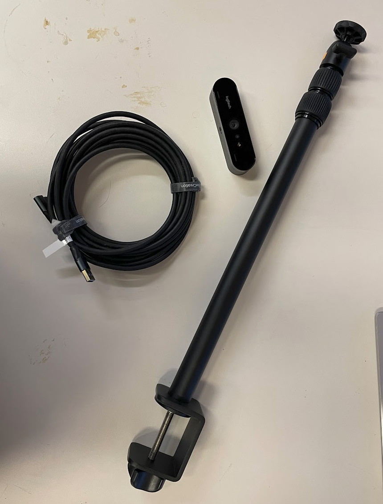
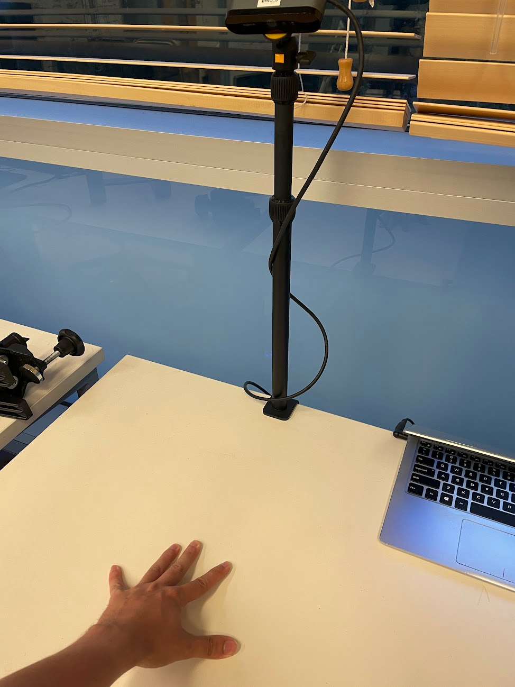
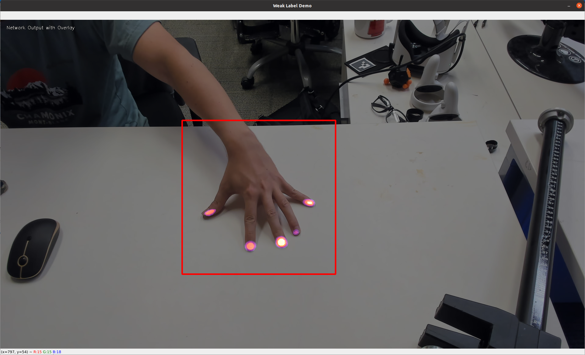

# Setting up the ContactLabel demo

## Getting the Hardware

First step is to get the hardware. If you have the time and money, getting the same hardware will improve your results a lot and minimize the hassle. You need three things:

* Logitech Brio 4k webcam. This was the main camera we used in the dataset $120: https://www.amazon.com/Logitech-Calling-Noise-Canceling-Correction-Microsoft/dp/B01N5UOYC4
* Camera table-mount. This is not required but will make your life easier $30: https://www.amazon.com/Camera-Adjustable-Tabletop-Streaming-Shooting/dp/B09W5CRYZ3
* Long USB A to C cable. Not required, but again will make your life easier $20: https://www.amazon.com/CableCreation-Compatible-Virtual-Reality-Headsets/dp/B08RMLWVL6

The code is tested to run on a PC running Ubuntu 20.04 with an RTX 3090 GPU. You can probably get it to work on any version of Linux and any modern GPU with >=4 GB RAM.  



## Set up the Hardware

Next, set up the hardware. I find that the system works well when illuminated by indoor lighting, and the camera is mounted ~55cm above the table, pointing down at a roughly 45 degree angle, as pictured. The system doesn't work quite as well when the scene is illuminated by strong lighting coming through windows.



## Install the Code

First, create a new conda environment and install PyTorch. There are many ways to accomplish this, and the precise version of PyTorch isn't important, as long as it's probably greater than 1.4.
```
conda create -n contact-label python=3.10
conda activate contact-label
conda install pytorch torchvision pytorch-cuda=11.7 -c pytorch -c nvidia
```

Next, install the segmentation-models-pytorch project. Must be done by cloning from git

```
git clone https://github.com/qubvel/segmentation_models.pytorch
pip install -e segmentation_models.pytorch/
```

Next, clone this repo and install the requirements.
```
git clone https://github.com/pgrady3/contact-label-demo.git
cd contact-label-demo
pip install -r requirements.txt
```

The model file can be downloaded from this link. It should be moved to `data/model/iccv_rebase_0.pth`
```
https://www.dropbox.com/scl/fi/gzqvb0bepx14bc40yy2vh/iccv_rebase_0.pth?rlkey=rjiy9vyp66aiwo8tj45zconha&dl=0
```

## Run webcam demo

Finally, you're ready to run the demo. Run this command, then the following window should appear.

```
python -m paper.demo_webcam --config iccv_rebase
```

